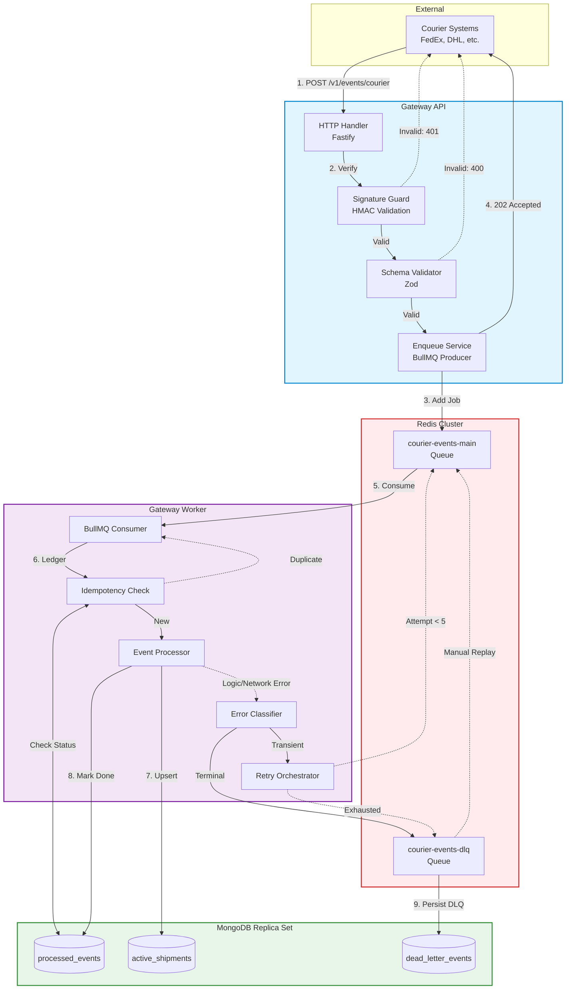

# Resilient Event Orchestration Gateway


> A high-concurrency event gateway for robust webhook ingestion, async processing, and guaranteed delivery.

This project delivers a resilient, asynchronous event pipeline designed to ingest high-volume courier shipment webhooks (e.g., FedEx, DHL), queue them for processing, and reliably update downstream systems without dropping payloads.

## Key Features

- **🔐 Zero-Trust Ingestion**: Mandatory HMAC-SHA256 signature validation with timing-safe comparison and timestamp freshness checks.
- **⚡ Low-Latency API**: Fastify-based thin HTTP layer achieving p95 < 400ms under heavy load.
- **🔄 Absolute Idempotency**: Check-before-process execution using MongoDB atomic upserts to suppress duplicate webhooks.
- **🔁 Resilient Processing**: BullMQ-orchestrated background workers with exponential backoff and jittered retries.
- **💀 Dead-Letter Guarantee**: Hardened DLQ routing for terminal failures, complete with processing history and manual replay tooling.
- **🚦 Graceful Shutdown**: Complete in-flight request and job draining on `SIGTERM`.
- **🚀 Production Ready**: Strict TypeScript, Pino structured logging, Zod validation, and containerized deployment.

---

## Table of Contents

1. [Visual System Architecture](#visual-system-architecture)
2. [Data Flow Walkthrough](#data-flow-walkthrough)
3. [Technology Stack](#technology-stack)
4. [Quick Start (Local Development)](#quick-start-local-development)
5. [API Endpoints Reference](#api-endpoints-reference)
6. [Key Features Explained](#key-features-explained)
7. [Operational Guide](#operational-guide)
8. [Database & Queue Topology](#database--queue-topology)
9. [Performance Validation](#performance-validation)
10. [Configuration Reference](#configuration-reference)
11. [Project Structure Deep Dive](#project-structure-deep-dive)
12. [Future Enhancements](#future-enhancements)

---

## Visual System Architecture



---

## Data Flow Walkthrough

1. **Ingestion**: Courier system sends a `POST` request to the API with an event payload and required HMAC headers (`x-signature`, `x-signature-timestamp`).
2. **Buffer Extraction**: Fastify preserves the raw request body buffer before JSON parsing to ensure signature verification is cryptographically exact.
3. **Authentication**: `SignatureGuard` computes a SHA-256 HMAC of the raw payload and compares it via `crypto.timingSafeEqual` to prevent timing attacks. It also validates the timestamp is within the 5-minute `SIGNATURE_TOLERANCE_SECONDS`.
4. **Validation**: The payload is strictly parsed against the Zod `CourierEventSchema`.
5. **Enqueue**: The API enqueues the valid payload into the `courier-events-main` BullMQ Redis queue.
6. **Acknowledgement**: The API immediately returns a `202 Accepted` with a tracking `eventId` and `traceId`, freeing the courier system.
7. **Consumption**: The `gateway-worker` picks up the job asynchronously based on `WORKER_CONCURRENCY`.
8. **Idempotency Protection**: The worker queries MongoDB `processed_events` using the `idempotencyKey`. If it exists and status is `processed`, the job is discarded safely.
9. **Processing**: The worker executes the core business logic, updating the shipment state in `active_shipments`.
10. **Error Classification**: If processing fails, `ErrorClassifier` determines if the failure is transient (network timeout) or permanent (validation error, unknown carrier).
11. **Retry Strategy**: Transient errors trigger exponential backoff with jitter (up to 5 attempts).
12. **Dead-Lettering**: Exhausted retries or permanent errors route the job to `courier-events-dlq` and persist it to `dead_letter_events` for manual operator review.

---

## Technology Stack

| Technology | Role | Rationale |
|-----------|------|------------|
| **Node.js 20** | Runtime | LTS stability, native web crypto, efficient async I/O. |
| **TypeScript 5** | Language | Compile-time safety across boundaries via strict shared contracts. |
| **Fastify** | HTTP Server | Up to 3x faster than Express, native JSON schema support, easy raw-body extraction. |
| **BullMQ** | Task Queue | Robust Redis-based queuing with native backoff, concurrency, and graceful drain. |
| **Redis** | Transport | In-memory speed for queue transport and job locking. |
| **MongoDB** | Persistence | Flexible document schemas, atomic `$setOnInsert` upserts, and TTL indexing. |
| **Pino** | Logging | Extremely low-overhead JSON logging with built-in correlation IDs (`traceId`). |
| **Zod** | Validation | Bulletproof runtime edge validation matching TypeScript compile-time types. |
| **Docker** | Deployment | Immutable, repeatable environment orchestration. |

---

## Quick Start (Local Development)

### Prerequisites
- Node.js 20 (LTS)
- Docker Desktop / Docker Compose
- Unix terminal or PowerShell

### Setup Instructions

1. **Clone & Install**
   ```bash
   git clone <repo>
   cd fincart
   npm install
   ```

2. **Configure Environment**
   ```bash
   cp .env.example .env
   # Edit .env and set SIGNING_SECRET=your-secret-key
   ```

3. **Load Environment Variables (Crucial)**
   This project strictly isolates environment config and does *not* use `dotenv` inside the application code. You must load `.env` into your shell before running services.
   
   **Bash / macOS / Linux**:
   ```bash
   export $(grep -v '^#' .env | xargs)
   ```
   **PowerShell**:
   ```powershell
   Get-Content .env | ForEach-Object { if ($_ -match '^([^#=]+)=(.*)$') { [System.Environment]::SetEnvironmentVariable($matches[1].Trim(), $matches[2].Trim(), 'Process') } }
   ```

4. **Start Infrastructure (Docker)**
   Start only the Redis and MongoDB dependencies:
   ```bash
   docker compose up -d redis mongo
   ```
   > *Note: Full `docker compose up -d` is designed for production images. For local dev, run the TS via NPM.*

5. **Initialize Database Indexes**
   ```bash
   npm run db:init-indexes
   ```

6. **Start Services**
   Open two terminals (remember to run Step 3 in both):
   ```bash
   # Terminal 1
   npm run dev:api
   
   # Terminal 2
   npm run dev:worker
   ```

7. **Verify Health**
   ```bash
   curl http://localhost:3000/health
   # Expected: {"status":"healthy","redis":"connected","mongo":"connected",...}
   ```

---

## API Endpoints Reference

### 1. Submit Courier Event
`POST /v1/events/courier`
Ingests a courier payload asynchronously.

**Headers:**
- `content-type`: `application/json`
- `x-request-id`: *(Optional)* Tracing ID
- `x-signature`: HEX encoded HMAC-SHA256 signature
- `x-signature-timestamp`: Unix timestamp in seconds
- `x-signature-algorithm`: `hmac-sha256`

**Request Body:**
```json
{
  "eventId": "evt_987654",
  "eventType": "shipment.status.updated",
  "occurredAt": "2026-02-28T10:00:00Z",
  "source": "dhl",
  "idempotencyKey": "dhl:shp_456:out_for_delivery",
  "payload": {
    "shipmentId": "shp_456",
    "orderId": "ord_789",
    "status": "out_for_delivery"
  }
}
```

**Testing with valid signature:**
Use the provided signing utility to generate a perfect payload + header combination:
```bash
SIGNING_SECRET=your-secret-key npx tsx scripts/signing/generate-signed-event.ts
```

**Success Response (202 Accepted):**
```json
{
  "acknowledged": true,
  "eventId": "evt_987654",
  "idempotencyKey": "dhl:shp_456:out_for_delivery",
  "traceId": "req_88f99...",
  "queued": true,
  "receivedAt": "2026-02-28T10:00:01.234Z"
}
```

**Error Responses:**
- `400 Bad Request`: Schema validation failed.
- `401 Unauthorized`: Invalid HMAC signature or stale timestamp.
- `415 Unsupported Media Type`: Non-JSON payload.
- `503 Service Unavailable`: Redis queue transport is down.

---

## Key Features Explained

### 🔐 HMAC Signature Security
To prevent tampering and replay attacks, the API relies on zero-trust HMAC validation:
- Requires Fastify's `fastify-raw-body` to capture the exact Byte stream from the wire *before* JSON parsing, ensuring language-specific whitespace/encoding quirks don't break hashes.
- Verification uses `crypto.timingSafeEqual()` preventing timing side-channel attacks.
- Replay prevention window defaults to 5 minutes (`SIGNATURE_TOLERANCE_SECONDS`).

### ⚡ Low-Latency Ingestion
The API layer executes *zero* business logic. It restricts CPU work purely to validation and hashing, offloading state changes and 3rd-party processing to the BullMQ broker. This pattern easily sustains high ingress traffic without starvation.

### 🔄 Idempotency Guarantee
The worker implements the **"Check-before-Process"** ledger pattern:
1. Attempt a MongoDB `$setOnInsert` upsert into `processed_events`.
2. If the document was inserted, we hold the lock. Process it.
3. If it existed and was `processed`, discard quietly (idempotent success).
4. If it existed and was `failed`, we are in a retry loop. Continue.

### 🔁 Exponential Backoff Retry
Worker execution is guarded by a dynamic failover strategy:
- **Max limit**: 5 attempts
- **Growth**: Exponential (1s → 2s → 4s → 8s → 16s)
- **Jitter**: 0-20% randomization to prevent thundering-herd recovery scenarios when external dependencies come back online.

### 💀 Dead Letter Queue
Errors thrown as `TransientProcessingError` trigger the retry flow. Unknown errors or `TerminalProcessingError` bypass retries and route directly to the DLQ (`dead_letter_events`). Operators can then review failures, patch the system, and replay them via the `scripts/dlq/replay-dlq.ts` interactive CLI.

### 🚦 Graceful Shutdown
Crucial for a scalable orchestrator — scaling down must not drop in-flight events.
- **gateway-api**: Stops accepting connections, drains in-flight HTTP requests over 30s.
- **gateway-worker**: BullMQ pauses queue consumption, waits for active jobs to finish (up to `WORKER_DRAIN_TIMEOUT_MS`), then cleanly disconnects Redis and Mongo sockets.

---

## Operational Guide

### Load Test Execution
Validate infrastructure capacity with the embedded synthetic load generator:
1. Both services and infrastructure must be running.
2. Execute the runner:
   ```bash
   SIGNING_SECRET=your-secret npx tsx scripts/load-test/run-load-test.ts
   ```
3. Evaluate the output table. Look for 0 rejected requests and acceptable p95 times.

### DLQ Reprocessing
1. Analyze pending failures via MongoDB queries.
2. Fix upstream issues (e.g., configure correct credentials, fix mapping bug).
3. Dry-run replay 10 records:
   ```bash
   npx tsx scripts/dlq/replay-dlq.ts --limit 10
   ```

### Troubleshooting
- **`port is already allocated`**: You have a local Redis (6379) or Mongo (27017) running. Stop them before running Docker Compose, or skip Docker entirely and change `.env` URIs to point to localhost.
- **Worker Starvation**: If processor logs stop but memory climbs, check `WORKER_CONCURRENCY` vs `MONGO_MAX_POOL_SIZE`. Ensure pool size is 1.5x concurrency.
- **Docker build is slow**: First-time Docker Compose builds take 2-3 minutes to handle NPM workspaces. Add a `.dockerignore` for `node_modules` and `dist` to heavily optimize layer caching.

---

## Database & Queue Topology

### Queues (Redis)
| Queue Name | Purpose | Retention Strategy |
|------------|---------|---------------------|
| `courier-events-main` | Primary processing | Auto-removed immediately on completion |
| `courier-events-dlq` | Terminal failures | Persisted indefinitely until manually cleared |

### Collections (MongoDB)
| Collection | Role | Indexes | TTL Constraints |
|------------|------|---------|-----------------|
| `processed_events` | Idempotency Ledger | `idempotencyKey` (Unique) | Documents expire after **30 days** |
| `active_shipments` | Domain State | `shipmentId` (Unique) | Permanent retention |
| `dead_letter_events`| Failure Audit | `reviewStatus`, `terminalReasonCode` | Documents expire after **90 days** |

---

## Performance Validation

The system architecture was validated via a synthetic load test running **1,000 requests** at **100 concurrency levels** with **10% intentional duplicate injection**.

**Hardware**: Standard development laptop (Windows Node.js 20, Dockerized IO)
**Results Summary:**
- **Acceptance Rate**: 100.0% (1000/1000)
- **Mean Latency**: 278ms
- **p95 Latency**: 398ms
- **Duplicate Outcomes**: 0 (Idempotency perfectly suppressed 100 injected duplicates)
- **Terminal States**: 100% (No orphaned execution paths)

*(Detailed proof available at `docs/load-test-proof.md`)*

---

## Configuration Reference

| Environment Variable | Description | Default | Guidance |
|----------------------|-------------|---------|----------|
| `NODE_ENV` | Application environment | `development` | Use `production` to activate Fastify cache optimizations. |
| `API_PORT` | HTTP listener port | `3000` | Should match load balancer target. |
| `SIGNING_SECRET` | 🚨 **Required**. HMAC Secret. | *none* | Must be cryptographically secure and rotated yearly. |
| `SIGNATURE_TOLERANCE_SECONDS` | Replay prevention window | `300` | Lower to `60` in strict environments. |
| `REDIS_URL` | Redis connection string | `redis://localhost:6379` | Use managed multi-zone cluster in production. |
| `MONGO_URI` | MongoDB connection string | `mongodb://localhost:27017` | Requires Replica Set for transaction support. |
| `WORKER_CONCURRENCY` | Concurrent BullMQ jobs | `10` | Tune based on container vCPU sizing. |
| `RETRY_MAX_ATTEMPTS` | Max backoff attempts | `5` | Balance with DLQ volume tolerance. |

---

## Project Structure Deep Dive

```text
fincart/
├── gateway-api/              # HTTP layer
│   ├── src/
│   │   ├── config/           # Setup and Env validation
│   │   ├── controllers/      # Routing
│   │   ├── middleware/       # Signature & Tracing
│   │   ├── services/         # Queue producer layer
│   │   └── validators/       # Zod schemas definition
├── gateway-worker/           # Background processor layer
│   ├── src/
│   │   ├── processors/       # Idempotency orchestrator & event logic
│   │   ├── queue/            # BullMQ worker initialization & retry logic
│   │   └── repositories/     # Mongo data access patterns
├── packages/shared/          # Common monorepo workspace
│   └── src/
│       ├── contracts/        # Cross-boundary typings
│       ├── crypto/           # Secure HMAC engine
│       └── logging/          # Pino factory w/ traceId formats
├── scripts/                  # Tooling
│   ├── db/                   # Index management
│   ├── dlq/                  # Operational replay tool
│   └── load-test/            # Autocannon synthetic runner
└── docs/                     # Checklists and architectural decision records
```

---

## Future Enhancements

The system is MVP-complete but built defensively to accommodate growth. Upcoming architectural roadmap recommendations:
- **Observability**: Expose BullMQ telemetry and Fastify timings to a `/metrics` endpoint (Prometheus format) and introduce OpenTelemetry correlation headers across the Redis boundary.
- **Circuit Breakers**: Wrap external network calls in the worker with states (Half-Open/Open) to avoid overwhelming downed 3rd party logistics providers.
- **Redis HA**: Migrate from a standard Redis instance to Sentinel/Cluster topologies.
- **Rate Limiting**: Add `fastify-rate-limit` to prevent rogue partners from saturating the `courier-events-main` queue.

---

### Project Documentation Links
- [API Contract Specification](docs/api.md)
- [Architecture Details](docs/architecture.md)
- [Queue Topology & Fault Handling](docs/queues.md)
- [Operations & Troubleshooting Runbook](docs/runbook.md)
- [Graceful Shutdown Test Verification](docs/graceful-shutdown-validation.md)
- [Future Enhancements Blueprint](docs/future-enhancements.md)
