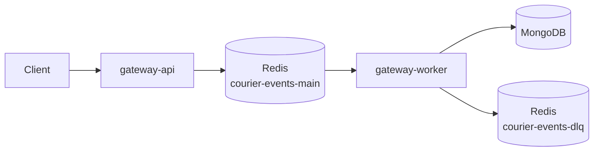

# Architecture

## System Overview

## Service Responsibilities

- `gateway-api`
  - Validates HMAC signature on raw body.
  - Validates payload schema.
  - Enqueues accepted events.
  - Returns 202/400/401/503.
  - No business workflow logic.
- `gateway-worker`
  - Consumes `courier-events-main`.
  - Performs idempotency check-before-process.
  - Updates shipment state.
  - Applies retry/backoff rules.
  - Routes terminal failures to DLQ and dead-letter persistence.
- `packages/shared`
  - Shared contracts, HMAC utilities, and logger factory.
  - No business I/O flow.

## Data Flow

1. Client sends signed `POST /v1/events/courier`.
2. Signature guard validates HMAC over raw bytes.
3. Schema validator verifies payload shape.
4. API publishes to `courier-events-main`.
5. API returns 202 with `traceId`.
6. Worker consumes job.
7. Worker checks `processed_events` idempotency state.
8. Worker upserts `active_shipments`.
9. On success, worker marks `processed_events` as `processed`.
10. On transient failure, worker marks failed and retries with backoff.
11. On permanent/exhausted failure, worker marks dead-lettered, stores in `dead_letter_events`, and publishes to `courier-events-dlq`.

## Layer Boundaries

- API: controllers -> services -> repositories.
- Worker: processors -> repositories.
- Dependencies flow inward.
- No circular imports.

## Technology Decisions

| Technology | Purpose        | Why                                                |
| ---------- | -------------- | -------------------------------------------------- |
| Fastify    | HTTP framework | Raw body access, Pino integration, high throughput |
| BullMQ     | Queueing       | Redis-backed queue with retries and worker model   |
| Pino       | Logging        | Structured JSON logs with low overhead             |
| Zod        | Validation     | Runtime schema safety                              |
| MongoDB    | Persistence    | Flexible docs and TTL index support                |

## Mongo Collections

| Collection           | Purpose                           | Key Indexes                                                  |
| -------------------- | --------------------------------- | ------------------------------------------------------------ |
| `processed_events`   | Idempotency and processing status | `idempotencyKey` unique, `status+updatedAt`, TTL `expiresAt` |
| `active_shipments`   | Current shipment/order state      | `shipmentId` unique, `orderId`, `currentState+updatedAt`     |
| `dead_letter_events` | Terminal failure archive          | `reviewStatus+createdAt`, `createdAt`, TTL `expiresAt`       |
